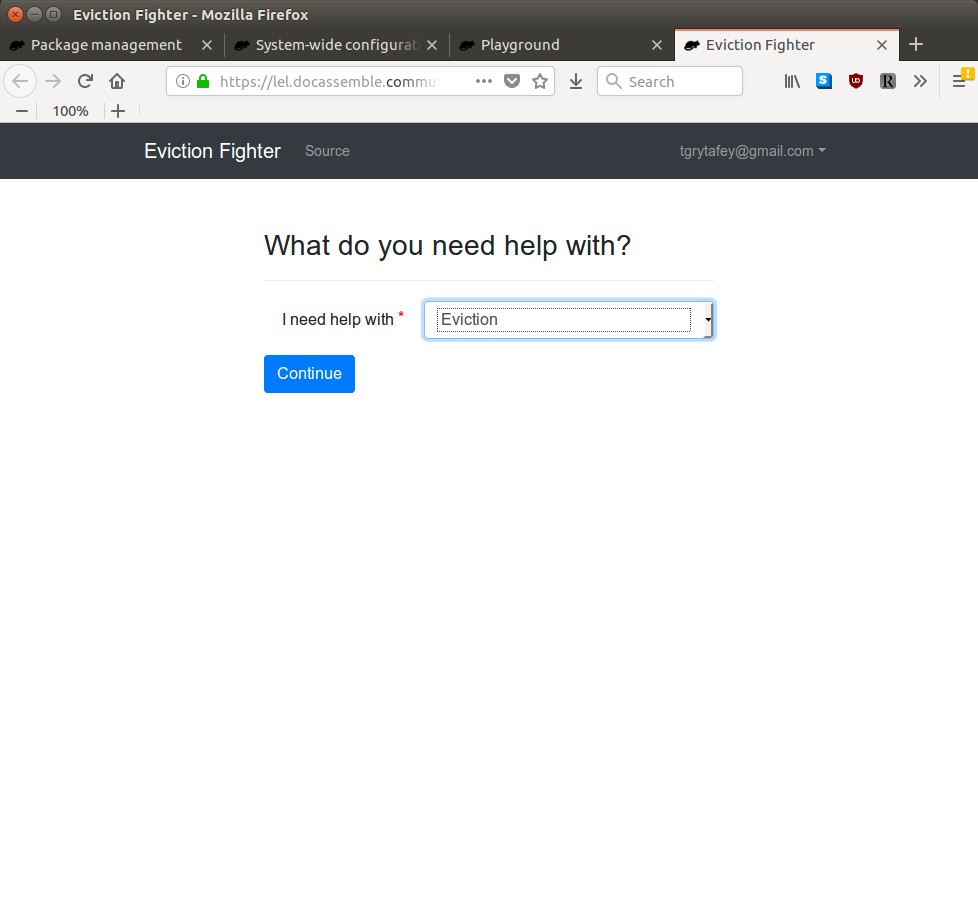
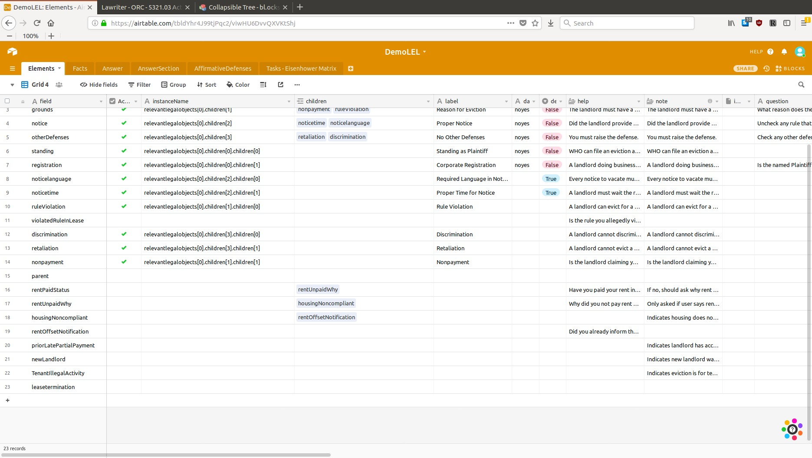
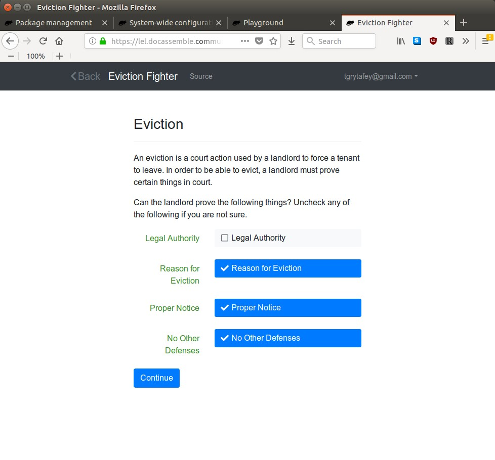
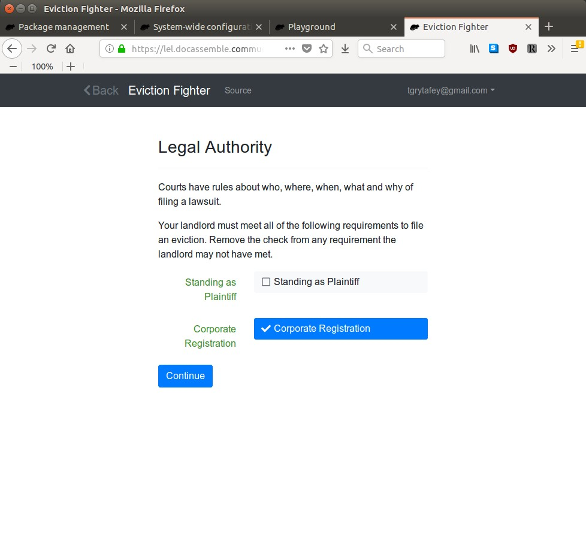
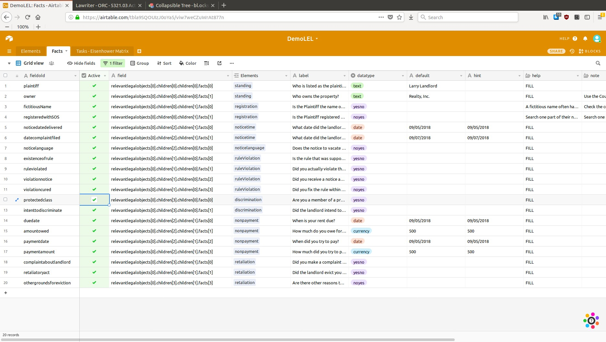
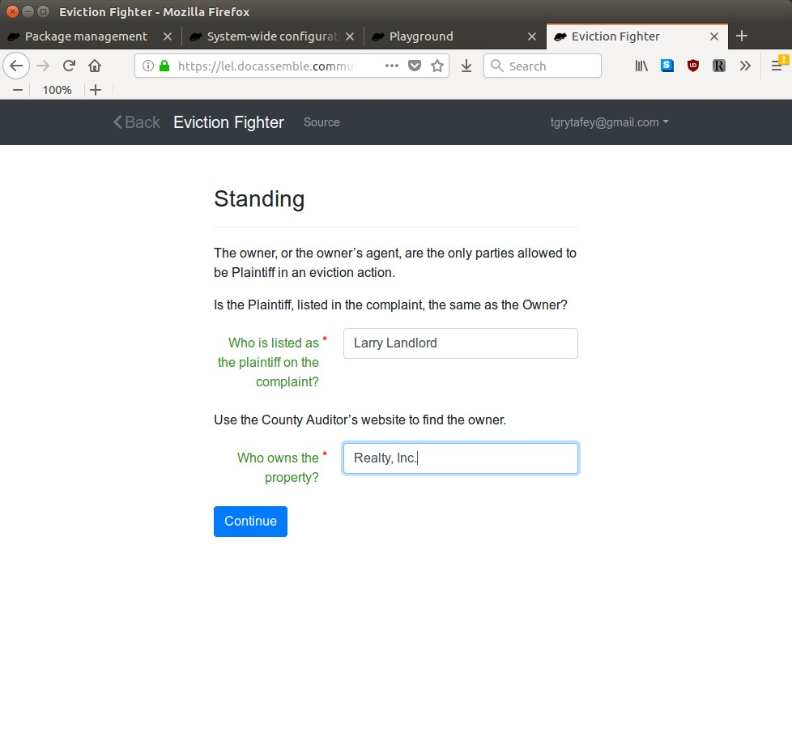
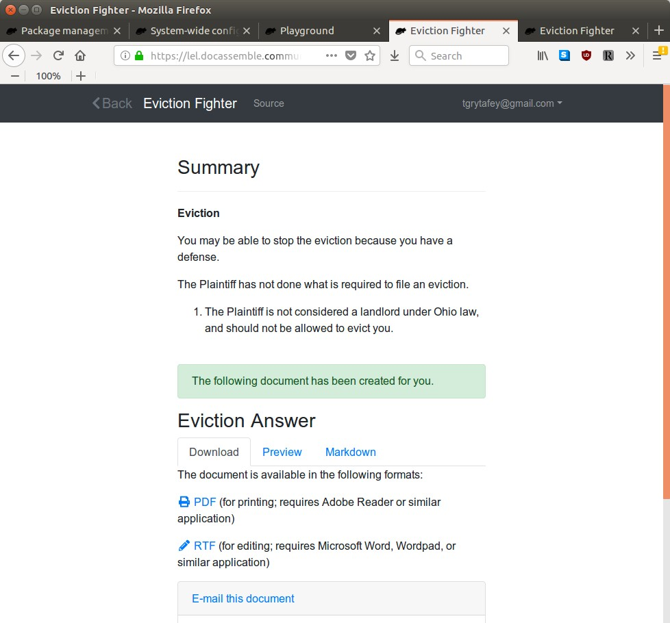

LEL Code
# <a name="initial blocks"></a>Initial Blocks 
## <a name="imports and metadata"></a>Imports and Metadata

```yaml
metadata:
  title: Eviction Fighter
  short title: evictionfighter
---
modules:
  - docassemble.base.util
  - .airtable
  - .auth
  - .params
  - .legalobject
---
imports:
  - requests
  - yaml
  - json
---
```
Libraries are also imported in legalobject.py

```python
from docassemble.base.core import DAObject, DAList
from docassemble.base.util import get_config
from docassemble.base.functions import word
from .airtable import Airtable
```


## Variables 

Two static variables used for accessing the AirTable are set in legalobject.py.  The airtable api key is set in the config file.  (When I tried to make this variable with underscores instead of spaces, it didn't work.)

```python
base_key = 'appA5wMpmdl4Vo8Kb'
api_key=get_config('airtable api key')
```

## Objects

The foundation of the Legal Elements Library is the use of Legal Objects.  The Eviction Fighter asks questions to determine what Legal Elements/Objects are relevant, then provides information stored as structured data in the relevant Legal Objects.

The sets and lists are for collecting the legalobjects that are "met" and have information in attributes that should be used.  During the interview, the objects are collected in sets to avoid duplicate objects.  Before the documents are generated, the sets are sorted into lists.

The Legal Objects are listed in legalobject.yml.  We can also set attributes of Legal Objects to special classes of Legal Objects by using generic objects.

```yaml
objects:
  - legalobjects: LegalObjectList.using(object_type=LegalObject,auto_gather=False)
  - answerset: DASet
  - answerlist: DAList
  - defensesset: DASet
  - defenseslist: DAList
  - remediesset: DASet
  - remedieslist: DAList
  - exhibitset: DASet
  - exhibitlist: DAList
  - affidavitset: DASet
  - affidavitlist: DAList
  - findingsoffactset: DASet
  - findingsoffactlist: DAList
  - conclusionsoflawset: DASet
  - conclusionsoflawlist: DAList
  - toolsset: DASet
  - toolslist: DAList
---
generic object: LegalObject
objects:
  - x.children: LegalObjectList.using(object_type=LegalObject,auto_gather=False)
  - x.facts: FactObjectList.using(object_type=FactObject,auto_gather=False)
---
generic object: FactObject
  - x.evidence: EvidenceList.using(object_type=Evidence,auto_gather=False)
```
The classes of Legal Objects are also defined in legalobject.py
### TODO
1. relevantnotmetlegalobjects isn't used, i think
1. Wouldn't it be better to have one legalobjects list
1. Add sets to collect information for pleadings
### Auto Gather

Objects that are in the class DAList have an automatic gathering system, where the interview will ask if there are any members of the list or if there is another.  To avoid this feature, objects have to have auto.gather set to False, and gathered has to be set to True.  You can also set True to gathered in a code block after something that needs to happen (like legalobjects.gathered).

```yaml
mandatory: True
code: |
  legalobjects.auto_gather = False
  answerset.auto_gather = False
  answerlist.auto_gather = False
  defensesset.auto_gather = False
  defenseslist.auto_gather = False
  remediesset.auto_gather = False
  remedieslist.auto_gather = False
  exhibitset.auto_gather = False
  exhibitlist.auto_gather = False
  affidavitset.auto_gather = False
  affidavitlist.auto_gather = False
  findingsoffactset.auto_gather = False
  findingsoffactlist.auto_gather = False
  conclusionsoflawset.auto_gather = False
  conclusionsoflawlist.auto_gather = False
  toolsset.auto_gather = False
  toolslist.auto_gather = False
  answerset.gathered = True
  answerlist.gathered = True
  defensesset.gathered = True
  defenseslist.gathered = True
  remediesset.gathered = True
  remedieslist.gathered = True
  exhibitset.gathered = True
  exhibitlist.gathered = True
  affidavitset.gathered = True
  affidavitlist.gathered = True
  findingsoffactset.gathered = True
  findingsoffactlist.gathered = True
  conclusionsoflawset.gathered = True
  conclusionsoflawlist.gathered = True
  toolsset.gathered = True
  toolslist.gathered = True
---
```


## Establishing Jurisdiction

First, we must answer the questions that will determine what law applies for a specific case, or, in other words, what set of legal objects are relevant.  These questions will determine the state and local jurisdiction and the type of housing, which will determine what rules and laws apply to a particular user.

This first version is made for Ohio law.  When we expand, we will add a question to determine location.

Currently, we only have a simple list of housing types.  The same list makes the options for the 'typeofhousing' field in the AirTable.

This section can also be reworked so [typeofhousing] is set with a series of easy to use questions.

```yaml
question: Type of Housing
field: typeofhousing
default: A1 Private Housing
choices:
  - A1 Private Housing
  - A2 Mobile Home Lot Rental
  - A3 Section 8 Certificates and Vouchers
  - A4 HUD Subsidized Projects
  - A5 Moderate Rehabilitation Projects
  - A6 Project-Based Certificate Projects
  - A7 Rural Housing Service Projects
  - A8 Public Housing
---
```


## Selecting Legal Action
Once we have the jurisdiction set, the



This question uses the "datatype: object" type of question, which allows you to pick an object. 

The interview makes a set of all legal objects whose parent attribute = 'parent' and is marked as active.  It then builds the attribute of the object from the AirTable fields.


```yaml
question: |
  What is the legal action?
fields:
  - Type: a_id
    input type: radio
    choices:
      - Eviction: recB0J8H7GkpRuQ80
---
code: |
  legalobjects.append(object_from_a_id(atid))
  legalobjects.gathered = True
---
```

## Creating Children LegalObjects

The filtering for type of housing occurs when the children legal objects are appended to the LegalObjectList.

Couldn't the filter happen when the parent object is gathered?  

```yaml
generic object: LegalObject
code: |
  for atid in x.childrenlist:
    tempobject = object_from_a_id(atid)
    if tempobject.active:
      if typeofhousing in tempobject.typeofhousing:
        x.children.append(tempobject,set_instance_name=True)
  x.children.gathered = True
---
```


### Function to pull data from AirTable

The function object_from_a_id sets the attributes for a legal object based on AirTable fields.  The function takes the id number for a row in AirTable.  (It can be tricky to figure out what the id is - I should look into if there is an easier way.)

Notice that some of the fields set attributes of funcobject.facts, instead of setting attributes of funcobject itself.  funcobject.facts is also initialized as a FactObjectList if a certain attribute (follabel) is found.

```python
def object_from_a_id(a_id):
	funcobject = LegalObject()
	table_name = 'Elements'
	api_response = Airtable(base_key, table_name, api_key)
	el = api_response.get(a_id)
	if 'field' in el['fields']:
		funcobject.field = el['fields']['field']
	if 'label' in el['fields']:
		funcobject.name = el['fields']['label']
		funcobject.label = el['fields']['label']
	if 'typeofhousing' in el['fields']:
		funcobject.typeofhousing = el['fields']['typeofhousing']
	funcobject.id = el['id']
	if 'datatype' in el['fields']:
		funcobject.datatype = el['fields']['datatype']
	else:
		funcobject.datatype = 'yesno'
	if 'Active' in el['fields']:
		funcobject.active = el['fields']['Active']
	else:
		funcobject.active = False
	if 'help' in el['fields']:
		funcobject.help = el['fields']['help']
	if 'image' in el['fields']:
		funcobject.image = el['fields']['image']
	if 'default' in el['fields']:
		funcobject.default = el['fields']['default']
	if 'note' in el['fields']:
		funcobject.note = el['fields']['note']
	if 'children' in el['fields']:
		funcobject.childrenlist = el['fields']['children']
	if 'facts' in el['fields']:
		funcobject.factslist = el['fields']['facts']
	if 'parent' in el['fields']:
		funcobject.parent = el['fields']['parent']
	if 'question' in el['fields']:
		funcobject.question = el['fields']['question']
	if 'explanation' in el['fields']:
		funcobject.explanation = el['fields']['explanation']
	if 'explanationbottom' in el['fields']:
		funcobject.explanationbottom = el['fields']['explanationbottom']
	if 'explanationifmet' in el['fields']:
		funcobject.explanationifmet = el['fields']['explanationifmet']
	if 'explanationifnotmet' in el['fields']:
		funcobject.explanationifnotmet = el['fields']['explanationifnotmet']
	if 'follabel' in el['fields']:
		funcobject.initializeAttribute('facts', FactObjectList)
	if 'folhtml' in el['fields']:
	   funcobject.facts.html = el['fields']['folhtml']
	if 'follabel' in el['fields']:
		funcobject.facts.label = el['fields']['follabel']
	if 'folexplanation' in el['fields']:
		funcobject.facts.explanation = el['fields']['folexplanation']
	if 'folquestion' in el['fields']:
		funcobject.facts.question = el['fields']['folquestion']
	if 'comparisontype' in el['fields']:
		funcobject.facts.comparisontype = el['fields']['comparisontype']
	if 'title' in el['fields']:
		funcobject.title = el['fields']['title']
	if 'law' in el['fields']:
		funcobject.law = el['fields']['law']
	if 'conclusion' in el['fields']:
		funcobject.conclusion = el['fields']['conclusion']
	return funcobject
```


## Asking Which Children Elements Are Relevant

This block produces a question screen for users to determine if the children LegalObjects are relevant.



```yaml
generic object: LegalObject
question:  ${ x.label }
subquestion: |
  % if hasattr(x,'explanation'):
  ${ x.explanation }
  % endif
  
  % if hasattr(x,'question'):
  ${ x.question }
  % endif
  
fields:
  - no label: x.childrendict
    datatype: checkboxes
    code: x.questioncode()
---
```
Here is an example of asking if the children of a child legal object are relevant.



The method x.questioncode is defined in legalobject.py for the class LegalObject.  The method pulls information from attributes of the LegalObject children for the question.

```python
class LegalObject(DAObject):

	def questioncode(self):
		questioncode = []
		for child in self.children:
			adict = {}
			adict[child.id] = child.label
			if hasattr(child,'help'):
				adict[u'help'] = child.help
			if hasattr(child,'default'):
				adict[u'default'] = child.default
			questioncode.append(adict)
		return questioncode
```

### Converting the dict of relevant children to object attributes

This is what causes .isrelevant to seem backwards - the user picks a child legal object to investigate by unclicking the checkbox, rather than clicking it.

```yaml
generic object: LegalObject
sets: x.children[0].isrelevant
code: |
  for chi in x.children:
    if x.childrendict[chi.id]:
      chi.isrelevant = False
    else:
      chi.isrelevant = True
---
```

## Setting ismet based on children and facts

This block sets .ismet for an object based on both its LegalObject children and FactObject children.  Since the final screen needs to know if a relevant legal object is met, this block makes docassemble find


```yaml
generic object: LegalObject
code: |
  if not hasattr(x, 'factslist') or x.facts.ismet:
    if not hasattr(x, 'childrenlist') or x.children.ismet:
      x.ismet = True
    else:
      x.ismet = False
  else:
	x.ismet = False
---
```


### ismet for LegalObjectLists

The children LegalObjects are in a LegalObjectList that is an attribute of the parent LegalObject.  LegalObjectLists such as x.children have their own attributes, including ismet.  Whether a LegalObject is met depends on whether x.children.ismet

```yaml
generic object: LegalObjectList
code: |
  counter = 0
  for legalobject in x:
		if legalobject.isrelevant and not legalobject.ismet:
		  x.ismet = False
    else:
      counter += 1
  if counter == len(x):
    x.ismet = True
  else:
    x.ismet = False
	
---
```

### Legal Object Class

```python
class LegalObject(DAObject):
	def ___init___(self, *pargs, **kwargs):
		self.initializeAttribute('children', LegalObjectList.using(object_type=LegalObject))
		self.initializeAttribute('facts', FactObjectList.using(object_type=FactObject))
		return super(LegalObject, self).init(*pargs, **kwargs)

```

# Fact Children

```python
class FactObject(DAObject):
	def ___init___(self, *pargs, **kwargs):
		self.initializeAttribute('children', LegalObjectList.using(object_type=LegalObject))
		return super(LegalObject, self).init(*pargs, **kwargs)

```

## Generating Fact Children

If a LegalObject has a facts attribute, after the LegalObject is added in the above block, then FactObjects are added to the LegalObject's FactObjectList with the following block.

```yaml
generic object: LegalObject
sets: 
  - x.facts
code: |
  if hasattr(x,'factslist'):
    x.facts.there_are_any = True
    for fid in x.factslist:
      x.facts.append(fact_from_a_id(fid),set_instance_name=True)
    x.facts.there_is_another = False
---
```


## Facts from the Airtable
FactObjects are populated from a different AirTable than Elements.  This also sets information for the EvidenceList, which is stored in each



```python
def fact_from_a_id(a_id):
	funcobject = FactObject()
	table_name = 'Facts'
	api_response = Airtable(base_key, table_name, api_key)
	el = api_response.get(a_id)
	funcobject.field = el['fields']['field']
	funcobject.label = el['fields']['label']
	funcobject.id = el['id']
	funcobject.datatype = el['fields']['datatype']
	if 'help' in el['fields']:
		funcobject.help = el['fields']['help']
	if 'hint' in el['fields']:
		funcobject.hint = el['fields']['hint']
	if 'image' in el['fields']:
		funcobject.image = el['fields']['image']
	if 'default' in el['fields']:
		funcobject.default = el['fields']['default']
	if 'note' in el['fields']:
		funcobject.note = el['fields']['note']
	if 'children' in el['fields']:
		funcobject.childrenlist = el['fields']['children']
	if 'parent' in el['fields']:
		funcobject.parent = el['fields']['parent'][0]
	if 'question' in el['fields']:
		funcobject.question = el['fields']['question']
	if 'explanation' in el['fields']:
		funcobject.explanation = el['fields']['explanation']
	if 'explanationbottom' in el['fields']:
		funcobject.explanationbottom = el['fields']['explanationbottom']
	if 'explanationifmet' in el['fields']:
		funcobject.explanationifmet = el['fields']['explanationifmet']
	if 'explanationifnotmet' in el['fields']:
		funcobject.explanationifnotmet = el['fields']['explanationifnotmet']
	return funcobject
```

## Fact Object Questions

This question will ask the fact questions needed to determine if a legal object is met.

Fact questions can have different kinds of datatypes as inputs, unlike LegalObject children questions which are yes and no questions.



```yaml
generic object: FactObjectList
sets: x[0]
question:  ${ x.label }
subquestion: |
  ${ x.explanation }
  
  ${ x.question }

  % if hasattr(x,'html'):
  ${ x.html }
  % endif
  
  
fields:
  code: x.questioncode()
---
```
The questioncode is a method of the class FactObjectList.  However, the data for the FactObjectList is part of the Elements AirTable, not the Facts AirTable, because a legal object has a single FactObjectList as an attribute (which will have FactObjects if it is a defense or the final branch of the children tree.

```python
class FactObjectList(DAList):

	def questioncode(self):
		questioncode = []
		for factt in self:
			adict = {}
			adict['field'] = factt.instanceName
			adict['label'] = factt.label
			adict['datatype'] = factt.datatype
			if hasattr(factt,'help'):
				adict[u'help'] = factt.help
			if hasattr(factt,'hint'):
				adict[u'hint'] = factt.hint
			if hasattr(factt,'image'):
				adict[u'image'] = factt.image
			if hasattr(factt,'default'):
				adict[u'default'] = factt.default
			if hasattr(factt,'note'):
				adict[u'note'] = factt.note
			questioncode.append(adict)
		return questioncode
		
```
## Fact .ismet

This section has the different ways a fact object 

1. Equals - if two
1. 2AllTrue
1. 1AllTrue
1. 3AllTrue

```yaml
generic object: FactObjectList
sets:
  - x.ismet
code: |
  if x.comparisontype == "Equals":
		if x[0] == x[1]:
			x.ismet = True
		else:
			x.ismet = False
  if x.comparisontype == "2AllTrue":
    if x[0] and x[1]:
      x.ismet = False
    else:
      x.ismet = True
  if x.comparisontype == "1AllTrue":
    if x[0]:
      x.ismet = False
    else:
      x.ismet = True
  if x.comparisontype == "3AllTrue":
    if x[0] and x[1] and x[2]:
      x.ismet = False
    else:
      x.ismet = True
  if x.comparisontype == "4AnyTrue":
    if x[0] and x[1] and x[2] and x[3]:
      x.ismet = True
    else:
      x.ismet = False
  if x.comparisontype == "CompareDate":
    if x[0].plus(days=3) <= x[1]:
      x.ismet = True
    else:
      x.ismet = False
  if x.comparisontype == "CompareDateAmount":
    if x[0] >= x[2]:
      if x[1] >= x[3]:
        x.ismet = False
      else:
        x.ismet = True
    else:
      x.ismet = True
---
```
# Evidence

## Asking if there is more evidence

- Needs to be asked only for facts that are relevant
- The evidencetype needs to determine what sets information is put in - testimony goes into an affidavit (a different one for each client)

Evidence is different than the LegalObject and Facts children - it isn't asking multiple questions for multiple children.  It is asking one question - How do you prove that fact? - and allowing multiple answers

Certain fields should be shown depending on type of evidence
- Documents: Title
- Plaintiff's Evidence: ParagraphOrExhibit, PoENumber
- Testimony: Statement
- WitnessTestimony: Statement, Name of Witness, Relation, Age

```yaml
generic object: FactObject
sets: x.evidence
question: How can you prove ${ x.facts.ev }?
subquestion: |
  ${ x.evexplanation }
  
  ${ x.evquestion }

  % if hasattr(x,'html'):
  ${ x.html }
  % endif
  
  
fields:
 - Type of evidence: evidencetype
   input type: radio
   choices:
     - Documents: documents
     - Photographs: documents
     - Plaintiff's evidence: plaintiffevidence
     - Witness testimony: witnesstestimony
     - Your testimony: yourtestimony
     
---
```
### Evidence class

I should remove the initializeAttribute for children

The evexplanation method takes the information for each piece of evidence and makes an explanation for it and adds the Evidence object to AffidavitSet or ExhibitSet.

```python
class EvidenceList(DAList):
	def ___init___(self, *pargs, **kwargs):
		self.initializeAttribute('children', LegalObjectList.using(object_type=LegalObject))
		return super(LegalObject, self).init(*pargs, **kwargs)
		
	def evexplanation(self)

```


# Summary Screen and Documents
- Stuff should be added to sets if a LegalObject is met.  When, where do I do that?
- Then stuff has to be sorted

## Summary question
The final summary block drives the entire docassemble interview.  The rest of the questions are used to determine the variables listed in this question.




```yaml
mandatory: True
question: Summary 
subquestion: |


  % for rlo in legalobjects:
  
  % endfor
attachment:
  - name: Eviction Answer
    filename: EvictionAnswer
    content file:
      - answer.md
```

## Nested methods

The nested methods are recursive methods, to build an explanation screen/hand-out 

```python
class LegalObject(DAObject):

	def nested_explain(self):
		
```

```python
class FactObjectList(DAList):

	def nested_fact(self):
		
```


## Information for the pleading


```yaml
question: Questions for the Caption
fields:
  - Name of Court in All Caps: courtNameAC
    default: Default Municipal Court
  - County in All Caps: countyAC
    default: BUTLER
  - Plaintiff: plaintiff
    default: Larry Landlord
  - Defendant: defendant
    default: Terry Tenant
  - Case Number: casenumber
    default: 18-CVG-99999
  - Judge: judge
    required: False
  - Title: title
    default: Answer
---
question: Questions for the Signature
fields:
  - Defendant street address: defendantstreetaddress
    default: 123 Main St.
  - Defendant City State Zip: defendantcitystatezip
    default: Default, OH 43611
  - Defendant Phone Number: defendantphonenumber
    required: False
  - Lawyer: lawyer
    default: Larry Lawyer
  - Lawyer street address: lawyerstreetaddress 
    default: 321 High St.
  - Lawyer City State Zip: lawyercitystatezip
    default: Suburbs, OH 43666
---
```
```markdown
---
"FirstFooterLeft": |-
  First of [TOTALPAGES] pages
  [END]
"HeaderLeft": |-
  Page [PAGENUM] of [TOTALPAGES]
  [END]
...

[BOLDCENTER] IN THE ${ courtNameAC } [NEWLINE]
${ countyAC }, OHIO

[BEGIN_CAPTION]

${ plaintiff }
  
  
Plaintiff,[NEWLINE]
  
  
[TAB]v.[NEWLINE]
  
  
${ defendant }
  
  
Defendant.
  
  
[VERTICAL_LINE]

CASE NO. ${ casenumber }[NEWLINE]
  
  
  
JUDGE: ${ judge }[NEWLINE]
  
  
  
${ title }[NEWLINE]

[END_CAPTION]

[BOLDCENTER] NOTICE CONCERNING PRO SE STATUS

Defendant is low-income and unable to afford an attorney, and has not been able to get any attorney to represent them.  Defendant is not licensed to practice law, and is not knowledgeable in the practice of law for purposes of presenting a case in court.

[BOLDCENTER] ANSWER

Unless Defendant specifically admits the allegations made by Plaintiff in the Complaint, Defendant denies the allegations in the Complaint.
```

